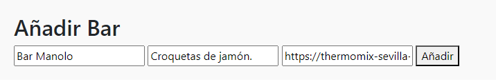
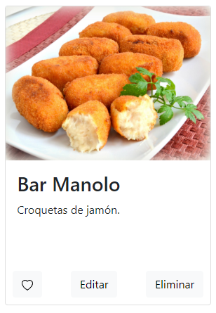

# Galería para el concurso de tapas

Página principal para un concurso de tapas. En esta página se encontrará un carrusel automático de imágenes y una galería de fotos con los nombres de los bares y una breve descripción de sus tapas.

### Carrusel de imágenes

El carrusel de imágenes que está al principio del sitio está hecho con Bootstrap. Permite tanto el movimiento automático como manual mediante la utilización de las flechas laterales

### Tarjetas

La información de los diferentes bares está organizada en tarjetas, que incluyen el nombre del bar, una imagen y una breve descripción de cada tapa. También permite guardar en favoritos los bares para posteriormente aplicar el filtro que solo muestra los bares favoritos.

Las tarjetas se generan desde el javaScript, donde hay un array con toda la información a mostrar de cada bar al inicio. 

### Añadir bar

En la página se ofrece la opción de añadir tantos bares como se desee. Para ello, hay un formulario debajo del header, donde si se introduce el nombre del bar, el nombre de la tapa y el link de una imagen (opcional), se creará una tarjeta nueva con ese bar. 

### Editar y eliminar

Para editar la información de una tapa, se cambian el nombre y la descripción a campos de texto editables. Una vez se haya editado, se guarda y se muestra en pantalla
En el caso de la eliminación, solamente hay que pulsar el botón "Eliminar" y desaparecerá de la página.

### Registro y login

En el formulario de registro se comprueba que todos los datos introducidos tengan el formato correcto.

* **Nombre y primer apellido:** Solo se pueden utilizar letras, números guiones bajos y tienen entre 3 y 20 caracteres.
* **Correo electrónico:** Tiene que seguir el formato de un email típico. Del estilo _hola@hola.com_.
* **Contraseña de acceso:** Al menos 8 caracteres, al menos una minúscula, una mayúscula, un número y un símbolo.
* **Confirmación de contraseña:** Deben coincidir ambas contraseñas.
* **Política de privacidad:** Por defecto está desmarcada y tiene que marcarse para poder registrarse.

Para el login, se han definido un usuario y contraseña válidos para probar su funcionamiento. (Usuario: email@ejemplo.com contraseña: P@ssw0rd!).

### Otros detalles

* Los logos de la página son imágenes vectoriales _svg_.
* Las imágenes de la página tienen el atributo `loading=lazy` para habilitar la carga perezosa.

#### Realizado por los alumnos Isaac Alonso y Juan Álvaro Flórez.

