### Manual para la API

Se utilizará XAMPP para el servidor y la base de datos.

En el directorio datos, está el script SQL con la base de datos utilizada por la API. En el phpMyAdmin se importará dicho script.

Una vez se tenga en marcha el servidor y se tenga la base de datos importada, copiamos la carpeta "concursoTapas" en la carpeta "www" que utiliza XAMPP.

Como de momento en el cliente no funciona la parte de los usuarios, no se requiere la instalación de firebase con composer. En caso de querer hacerlo aún así, bastaría con abrir una terminal, colocarse en el directorio principal de la API (concursoTapas), y ejecutar el comando `composer install`.

Se puede probar que la API funciona correctamente si al acceder a [http://localhost/www/concursoTapas/api/tapas/](http://localhost/www/concursoTapas/api/tapas/) se muestra un JSON con las tapas de la base de datos.

Si no se ha podido copiar la API en esa ruta exacta, se deberá de ajustar el archivo `galeria.js` con la URL correcta.

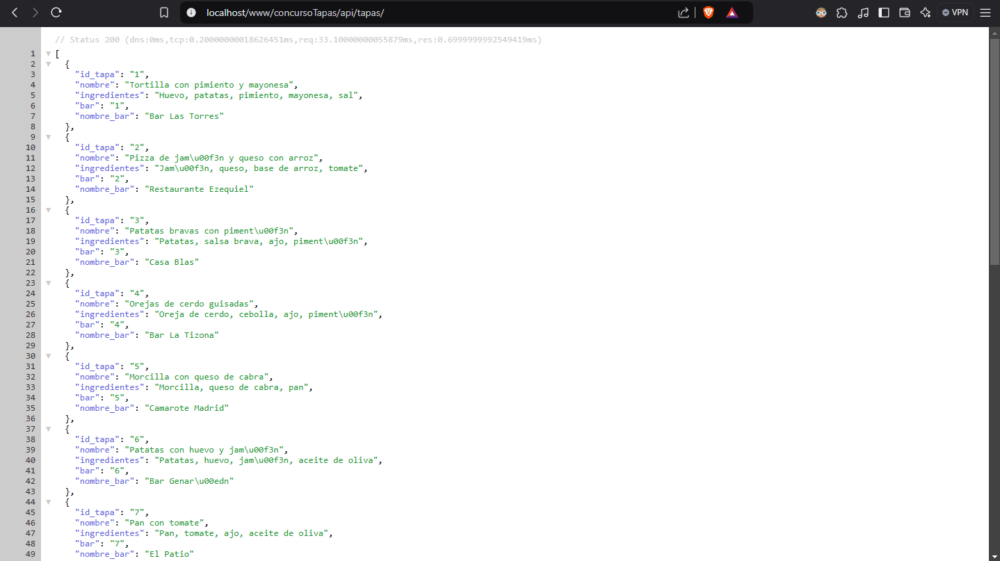

Por el momento faltan algunas funciones importantes pero en el código JavaScript se utiliza Fetch para recoger los datos en JSON de las tapas mostradas, se utiliza también Async/Await y se carga la Galería con AJAX. Próximamente añadiremos las funcionalidades que hemos tenido que quitar de la versión anterior que utilizaba solamente DOM. Para ver esa versión, haz clic [aquí](https://jflorc01.github.io/galeriaDOM/).

# Galería para el concurso de tapas

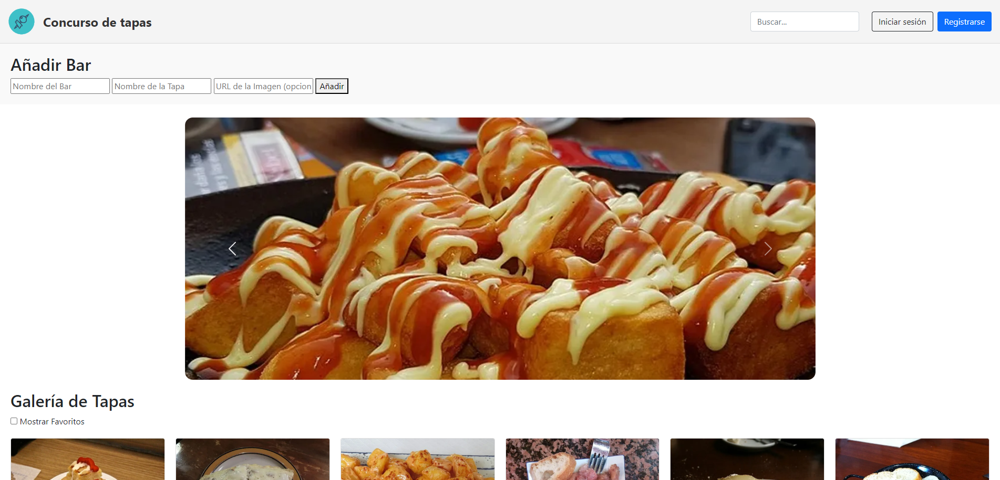

Página principal para un concurso de tapas. En esta página se encontrará un carrusel automático de imágenes y una galería de fotos con los nombres de los bares y una breve descripción de sus tapas.

### Carrusel de imágenes

El carrusel de imágenes que está al principio del sitio está hecho con Bootstrap. Permite tanto el movimiento automático como manual mediante la utilización de las flechas laterales

### Tarjetas

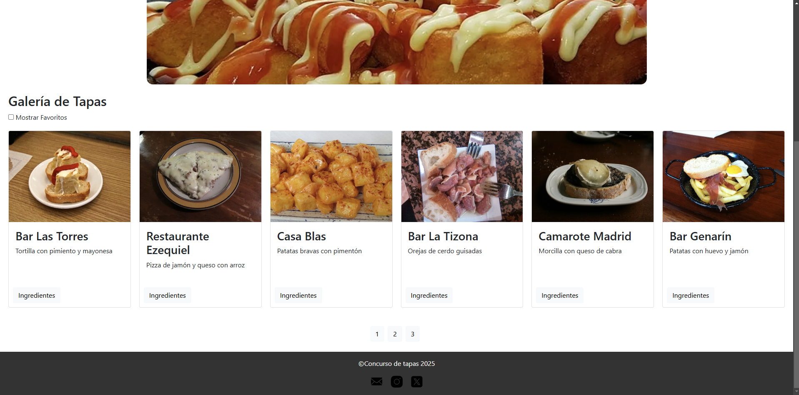

La información de los diferentes bares está organizada en tarjetas, que incluyen el nombre del bar, una imagen y una breve descripción de cada tapa. 

Las tarjetas se generan desde el javaScript, donde hay un array con toda la información a mostrar de cada bar al inicio. 

### ingredientes

Al pulsar el boton de ingredientes mostrara una ventana emergente que los especifique.

### Registro y login

En el formulario de registro se comprueba que todos los datos introducidos tengan el formato correcto.

* **Nombre y primer apellido:** Solo se pueden utilizar letras, números guiones bajos y tienen entre 3 y 20 caracteres.
* **Correo electrónico:** Tiene que seguir el formato de un email típico. Del estilo _hola@hola.com_.
* **Contraseña de acceso:** Al menos 8 caracteres, al menos una minúscula, una mayúscula, un número y un símbolo.
* **Confirmación de contraseña:** Deben coincidir ambas contraseñas.
* **Política de privacidad:** Por defecto está desmarcada y tiene que marcarse para poder registrarse.

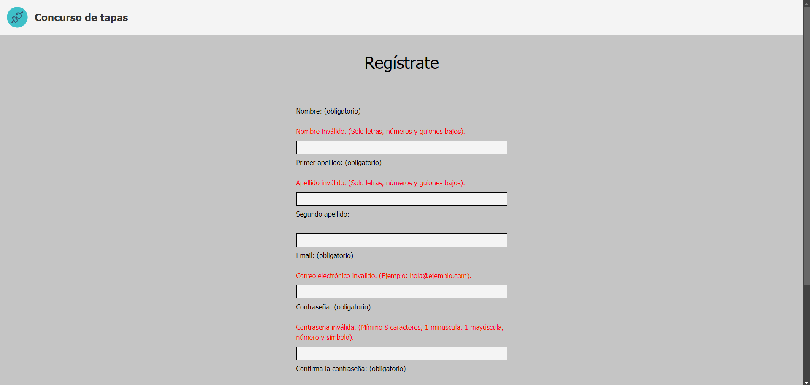

Para el login, se han definido un usuario y contraseña válidos para probar su funcionamiento. (Usuario: email@ejemplo.com contraseña: P@ssw0rd!).

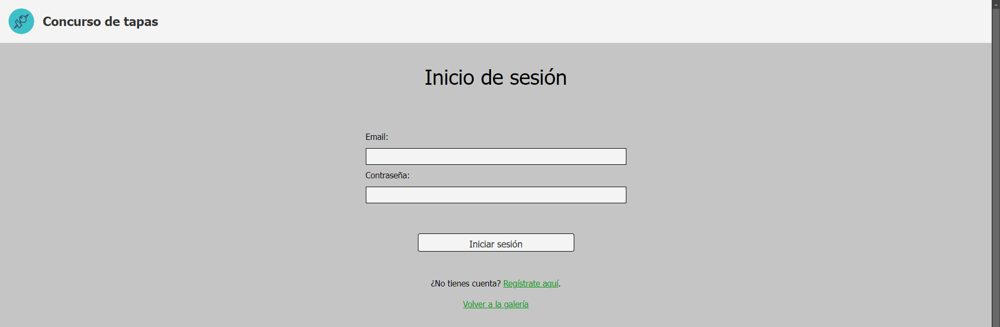

### Otros detalles

* Los logos de la página son imágenes vectoriales _svg_.
* Las imágenes de la página tienen el atributo `loading=lazy` para habilitar la carga perezosa.

### Estudio de usabilidad

1-	Añadir el uso de paginación a la galería de tapas:
    La galería de tapas no tiene límite a la hora de mostrar las tapas y esto puede afectar al rendimiento de la página, utilizando un sistema de paginación solucionamos este problema 

2-	Añadir un botón al buscador:
    Al no tener un botón el buscador puede confundir a los usuarios, colocando uno para dar el control al usuario evitamos este problema

3-	Añadir visibilidad al error en la pantalla de inicio de sesión:
    Añadiendo un comentario de error al inicio de sesión solucionamos que los usuarios sepan que error están cometiendo 

4-	Añadir un comentario que especifique que se ha creado bien una nueva tapa: 
    Añadiendo un comentario al añadir una tapa correctamente informamos al administrador de que se ha guardado correctamente evitando confusiones:
    
5-	Diseño del botón de añadir: 
    Añadiendo un diseño que interactúe con el usuario mejoramos el atractivo de la página.

### Diseño Adaptativo

Diseño para PC de escritorio:

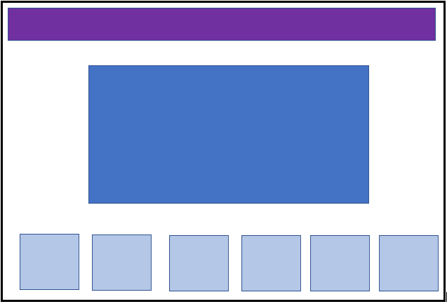

Diseño para móvil en vertical:

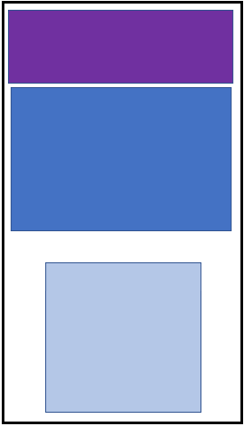

Diseño para móvil en horizontal o Tablet:

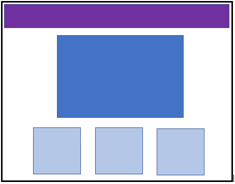

Para el pc de escritorio contará con una barra de navegación amplia con el logo y el nombre a la izquierda y el buscador y botones de login y registro a la derecha.

El carrusel de imágenes estará centrado en la página.

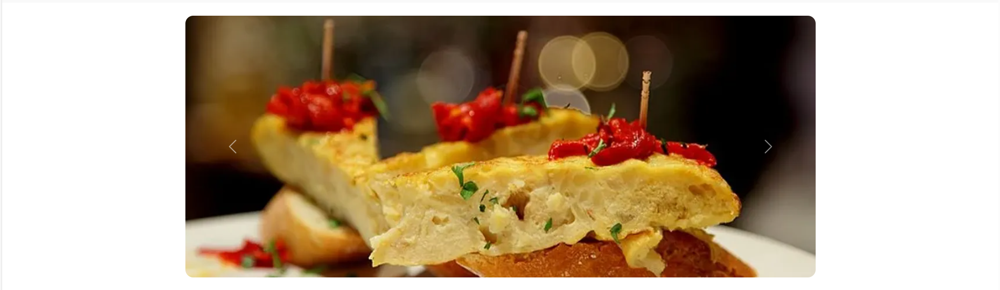

La galería de imágenes contará con un checkbox a la izquierda para filtrar por favoritos y las tapas se agruparán en filas de 6.

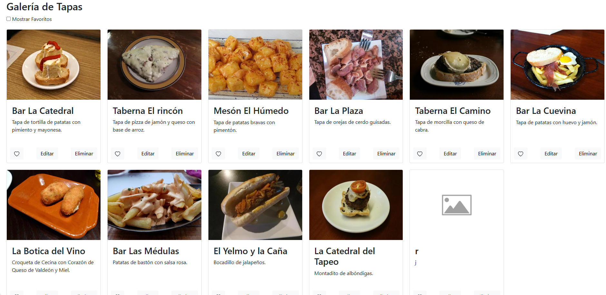

Para el diseño en móviles la disposición de la barra de navegación cambia contando con el logo y el nombre en la primera file, el buscador y dependiendo de la pantalla del móvil también el botón de inicio de sesión en la segunda fila y por último en la tercera el botón de registro.

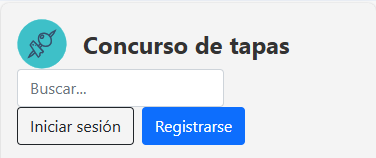

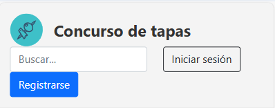

En el diseño del móvil el carrusel cambia de tamaño para adaptarse al tamaño de la pantalla.

Por último la disposición de la galería también cambia pasando a estar al principio el checkbox que filtra por favoritos y agrupando las tapas en solo una columna.

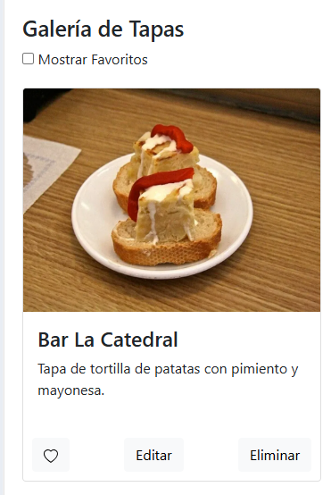

Para el tamaño del iPad o Tablet dependiendo del tamaño de la pantalla, pero principalmente la barra de navegación será igual a la del pc, pero con las nuevas medidas.

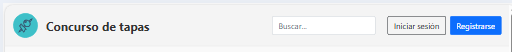

El carrusel se ajusta automáticamente al tamaño de la pantalla.

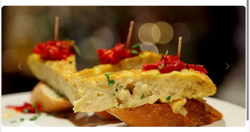

Y la galería se agrupa en filas de 3.

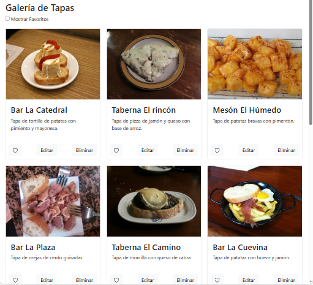

Para el inicio de sesión y el registro en pc los distintos campos estarán centrados.

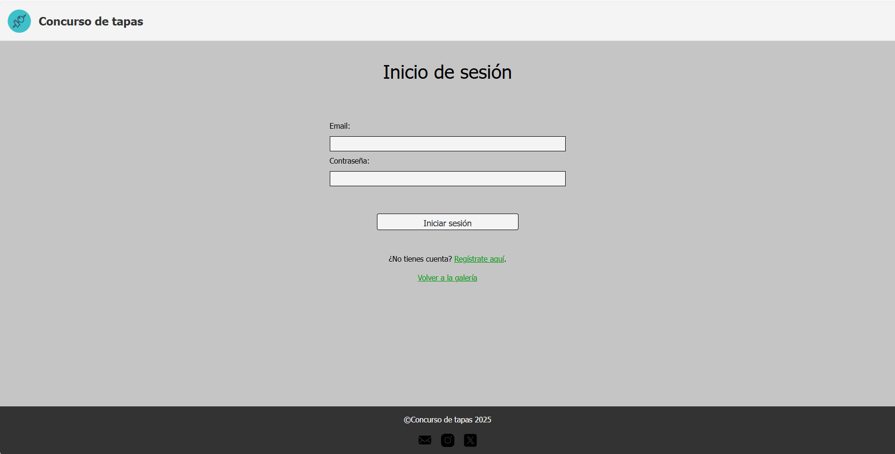

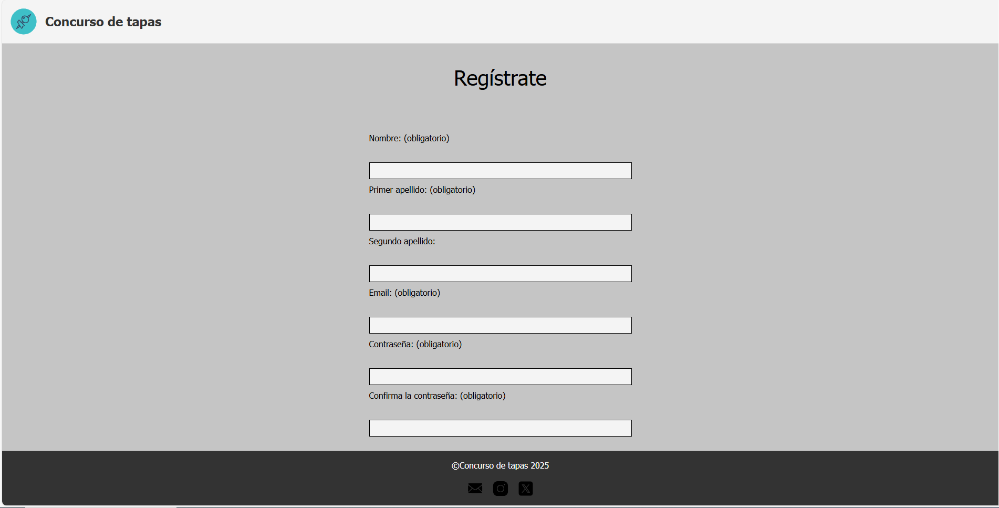

Mientras que en móvil ocuparan todo el ancho de la pantalla.

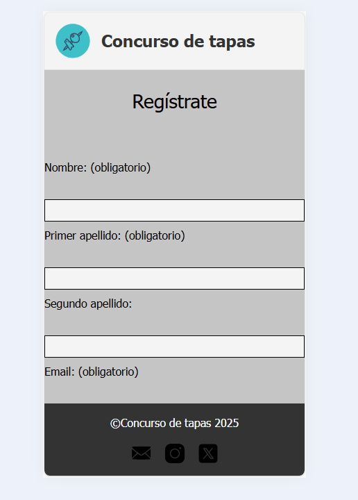

#### Realizado por los alumnos Isaac Alonso y Juan Álvaro Flórez.

